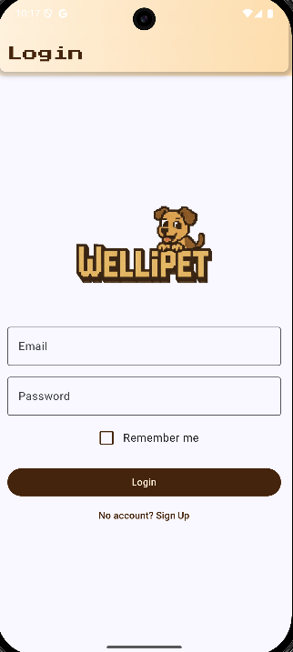
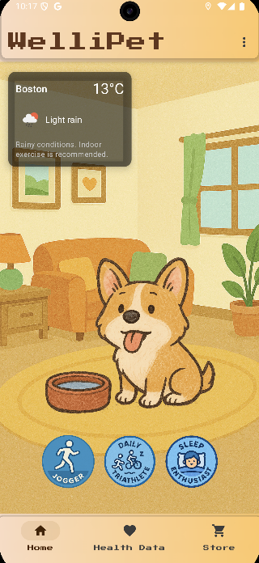
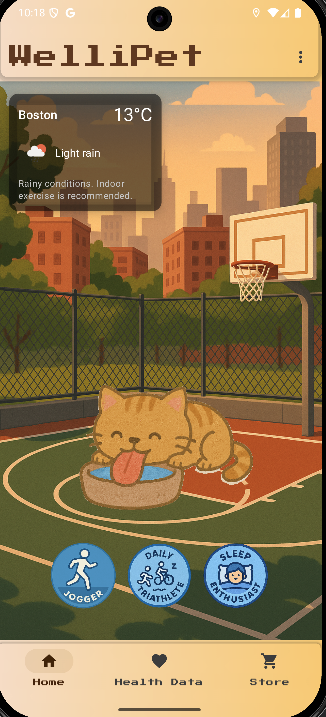
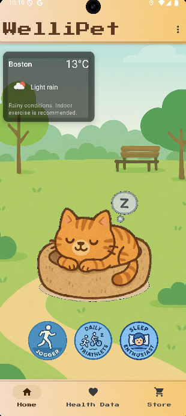
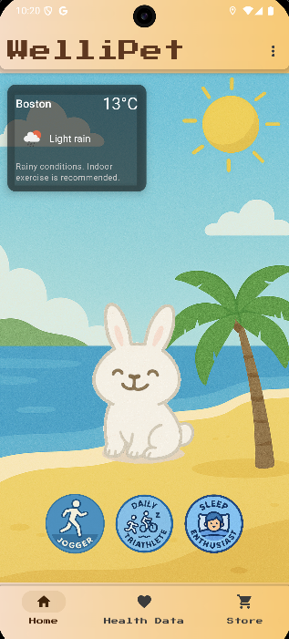
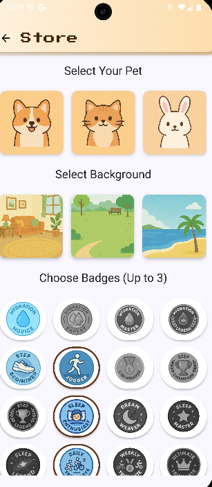
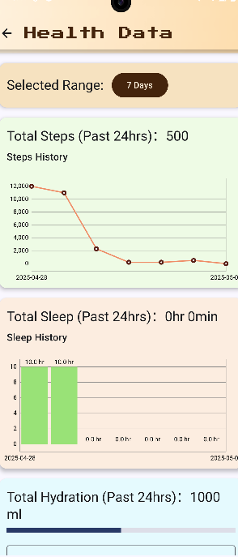
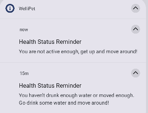
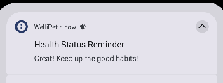

# cs501_final_project
# 🐾WelliPet (Virtual Pet Health Companion)

A mobile health and wellness app that links your real-life habits to the well-being of a virtual pet. Stay healthy, stay happy — for you and your companion!

---

## 📱 Overview

**WelliPet** is an Android app that gamifies health tracking through emotional connection. By integrating your fitness, sleep, and hydration data with a virtual pet, the app encourages healthy behavior through positive reinforcement, daily challenges, and interactive rewards. Built with Kotlin, Jetpack Compose, and Android Health Connect, the app offers a playful and meaningful approach to wellness.

---

## 🎯 Features

- 🐶 **Virtual Pet**: Interact with a responsive pet that reflects your lifestyle.
- 📊 **Health Tracking**: Syncs sleep, steps, and hydration from Health Connect.
- 🏆 **Gamified Progress**: Earn rewards, unlock pet items, and maintain streaks.
- 📍 **Sensor Integration**:
  - GPS: Fetches your current location to display local weather and personalized workout suggestions.
  - StepCounter: Detects motion for activity tracking.
- 🧭 **Multi-Device Support**:
  - Phone: Full interactive experience.
  - Smartwatch: Glanceable pet mood and health stats.
- 🖌️ **Customization & Store**: Choose different pets and backgrounds, and unlock new achievements step by step based on your daily health metrics.

---

## ❓ Q & A

**Q: What does each pet status mean?**  
A: Each status reflects your recent habits over the last 1–2 hours:  
- **happy** — You’ve met both your hydration and activity targets.  
- **thirsty** — Your water intake in the past hour is below target.  
- **sleepy** — Your step count in the past two hours is below target.

**Q: What are Badges?**  
A: Badges are achievements you unlock by hitting daily or multi‑day goals in hydration, steps, and sleep. You can display up to three badges on your pet to show off your progress.  
- **Daily badges** reward you for a single‑day achievement.  
- **Streak badges** reward you for consecutive days of meeting the goal.  
- **Combined badges** reward multi‑category completion (e.g. hydration + steps + sleep).

**Badge List:**  
- 💧 **Hydration Novice**: Single-day hydration ≥ 2000 ml  
- 🚰 **Hydration Expert**: 7 consecutive days with daily hydration ≥ 2000 ml  
- 🌊 **Hydration Master**: 14 consecutive days with daily hydration ≥ 2000 ml  
- 🔱 **Hydration Legend**: 30 consecutive days with daily hydration ≥ 2000 ml  

- 👟 **Step Beginner**: Single-day step count ≥ 5 000 steps  
- 🏃‍♂️ **Jogger**: Single-day step count ≥ 10 000 steps  
- 🥇 **Step Sprinter**: 7 consecutive days with daily step count ≥ 10 000 steps  
- 🏅 **Step Champion**: 14 consecutive days with daily step count ≥ 10 000 steps  
- 🏆 **Step Legend**: 30 consecutive days with daily step count ≥ 10 000 steps  

- 🛌 **Sleep Enthusiast**: Single-day sleep duration ≥ 7 hours  
- 🌙 **Dream Weaver**: 7 consecutive days with daily sleep ≥ 7 hours  
- ⭐ **Sleep Master**: 14 consecutive days with daily sleep ≥ 7 hours  
- 🌌 **Sleep Legend**: 30 consecutive days with daily sleep ≥ 7 hours  

- 🤸‍♂️ **Daily Triathlete** (Combined): Complete Hydration Novice, Jogger, and Sleep Enthusiast in one day  
- 🏅 **Weekly Triathlete** (Combined): 7 consecutive days completing Hydration Novice, Jogger, and Sleep Enthusiast  
- 👑 **Ultimate Triathlete** (Combined): 30 consecutive days completing Hydration Novice, Jogger, and Sleep Enthusiast  

---

## 🛠️ Tech Stack

| Category        | Tools & Frameworks                |
|----------------|-----------------------------------|
| Language        | Kotlin                            |
| UI              | Jetpack Compose + Material Design |
| Database        | Firebase (Auth + Sync)            |
| Health API      | Android Health Connect            |
| Sensors         | GPS, StepCounter                  |
| Testing Devices | Phone + smartwatch                |

---

## 📸 Screenshots / Wireframes











---

## 🧪 Testing on Emulator with HealthConnect Toolbox

To simulate health data on an emulator — even without a physical device — we provide a convenient method using **HealthConnect Toolbox**:

1. Locate the file `HealthConnectToolbox-2_0_0.apk` in the `WelliPet` project directory.
2. Install the toolbox using the command:

   ```bash
   adb install HealthConnectToolbox-2_0_0.apk
   ```

3. Once installed on your emulator, open the Toolbox app and use it to inject mock health data (e.g., steps, hydration, sleep). This enables complete app testing without needing real sensor input or a physical phone.

For smartwatch testing on emulator:
- Use **Android Studio’s “Pair Wearable”** feature to link a Wear OS emulator with your phone emulator.
- Follow the guided steps to complete pairing, then test interactions across devices — just as if you had a real watch and phone.

This setup ensures that **WelliPet** can be tested on both phone and watch emulators, fulfilling the multi-device requirement effectively.

---

## 📦 Project Structure

```
com.example.wellipet
├── api
│   ├── LocationRepository.kt      // Streams location updates via FusedLocationProvider
│   ├── OpenWeatherMapService.kt   // Retrofit interface for OpenWeatherMap endpoints
│   ├── RetrofitClient.kt          // Builds Retrofit instance & exposes weatherService
│   └── WeatherResponse.kt         // Data models for weather JSON payloads
│
├── data
│   ├── repository
│   │   ├── FirebaseUserRepository.kt  // CRUD + real‑time listeners for /users/{uid} in Firestore
│   │   └── HealthRepository.kt        // High‑level health API, caching & business logic
│   │
│   ├── source
│   │   └── HealthConnectSource.kt     // Low‑level Android Health Connect read/write calls
│   │
│   ├── AuthPreferences.kt         // DataStore for “remember me” flag
│   └── BadgeCalculator.kt         // Calculates unlocked badges based on health metrics
│
├── navigation
│   └── AppNavHost.kt              // Compose navigation graph & routes
│
├── ui
│   ├── auth
│   │   ├── AuthViewModel.kt       // Manages FirebaseAuth state & navigation events
│   │   ├── LoginScreen.kt         // Login form, Health‑Connect permission flow, Wear OS listener registration
│   │   └── SignUpScreen.kt        // Sign‑up form & Firestore user‑doc initialization
│   │
│   ├── component
│   │   ├── BottomNavigationBar.kt // Bottom nav bar for mobile
│   │   ├── CuteTopBar.kt          // Gradient top bar with custom Google Font
│   │   ├── HydrationBarChart.kt   // Compose wrapper for hydration bar chart
│   │   ├── SleepBarChart.kt       // Compose wrapper for sleep history bar chart
│   │   └── StepsLineChart.kt      // Compose wrapper for steps history line chart
│   │
│   ├── mobile
│   │   ├── home
│   │   │   ├── HomeViewModel.kt   // Loads weather, computes pet mood, exposes flows
│   │   │   └── HomeScreen.kt      // Main UI: pet display, weather card, badges, nav bar
│   │   │
│   │   ├── healthdata
│   │   │   ├── HealthDataViewModel.kt // Reads steps/sleep/hydration, error handling
│   │   │   └── HealthDataScreen.kt     // Displays totals, charts, hydration entry form
│   │   │
│   │   └── store
│   │       ├── StoreViewModel.kt      // Persists selected pet, background, badges; merges unlocked set
│   │       └── StoreScreen.kt         // UI to pick pet, background & up to 3 badges
│   │
│   └── model
│       ├── BadgeDefinition.kt     // Definitions of badge criteria & unlock logic
│       └── PetGifMapper.kt        // Maps pet key & status to drawable resource IDs
│
├── utils
│   └── WeatherUtil.kt             // Helpers for weather description → icon mapping
│
├── worker
│   └── HealthCheckWorker.kt       // Periodic WorkManager job: checks pet status & sends notifications
│
└── MainActivity.kt                // Entry point: schedules WorkManager job to run HealthCheckWorker


```
---

## 🚧 Project Timeline

| Milestone      | Features Implemented                                      |
|----------------|------------------------------------------------------------|
| Week of Mar 16 | Proposal + GitHub setup + wireframes                      |
| Mar 31         | Firebase DB, basic Compose UI                        |
| Apr 13         | Health Connect integration, dual device testing           |
| Apr 27         | Sensors + animations                             |
| May 4          | Final version, polish, presentation & report              |

---

## 🙋‍♀️ Authors

- Chaojen Chiu ， Ruiyang Cao  

---

